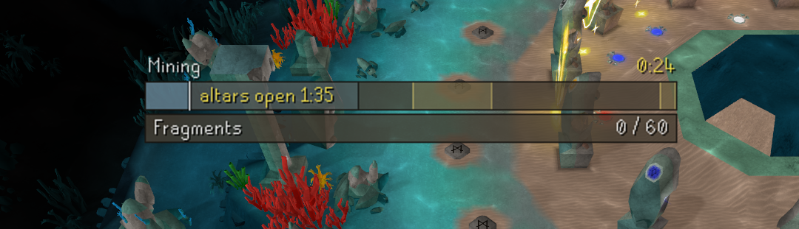
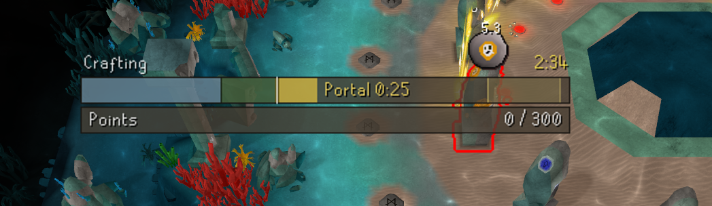

# GOTR Progress Bar

A RuneLite plugin for Guardians of the Rift that shows the whole round as one scrolling
timeline bar — so you always know what phase you're in and when the next portal is due
without watching chat or the HUD timers.

## Screenshots

<!-- Drop in-game captures into the screenshots/ folder with these names and they'll show here. -->



## What it shows

**Between rounds** — a plain countdown, because nothing can be done in that phase:

```
| Next game                                    0:42 |
```

**In a round** — one timeline. The white "now" line is the only thing that moves:

```
  Mining                                        4:37
| ===cursor sweeps left to right===|  yellow=portal  |
| Fragments  ██████████░░░░░░           84 / 120     |
```

- A **fixed-scale scrolling window** (5 minutes of game time). During mining the white cursor
  sweeps left-to-right through a stationary timeline; once the altars open it pins in place and
  the timeline scrolls smoothly past it. Nothing ever rescales or jumps.
- The **mining phase** (locked 2 minutes, exact to the game tick) is a light-blue section with
  its own "altars open" countdown. The **crafting** trail behind the cursor is green.
- **Portal sections sit at their real times**: transparent-yellow tolerance windows where
  portals are expected (portals are timer-based within a tolerance), solid-yellow sections
  spanning a portal's actual open time, and an exact `Portal 0:18` despawn countdown while one
  is open. Estimates re-anchor only when a portal actually spawns — even one you joined
  mid-life, which is back-dated to its true spawn time.
- The **goal sub-bar** underneath tracks your current goal: fragments while mining, points
  while crafting — red until the goal is met, green after.
- The bar stays up for the whole round, including inside the rune altars.

## Goals (configurable)

- **Fragment goal** (default 120) — for the mining phase.
- **Points metric** — what the crafting goal counts: **Combined** energy, **Elemental only**,
  **Catalytic only**, or **Both (split)**, where each side tracks its own goal in half the
  sub-bar.
- **Combined / Elemental / Catalytic goals** — the target values used by the metrics above.
  Set any goal to 0 to hide that sub-bar.

## Other options

- **Size** — Small, Medium, or Large preset (bar thickness and font).
- **Bar width** — 280–700 px.
- **Opacity** — 15–100% (100% is fully opaque).
- **Show game timer** — toggle the elapsed round clock.
- **Show portal markers** — toggle past/estimated portal sections (a live portal always shows).
- **Show between-round countdown** — hide the "Next game" bar when no round is running.
- **Goal colors** — below-goal and goal-met sub-bar colors.

## What this plugin does NOT do

It does not highlight altars, count essence, send notifications, duplicate the power number the
game already shows, or suggest actions — for those helper features use
[Guardians of the Rift Helper](https://runelite.net/plugin-hub/show/guardians-of-the-rift-helper).
This plugin only answers "where is the round at, and when is the next portal?" in one bar.

It is fully passive: it reads game state already on your screen and renders it as a timeline.
No automation, no external servers, no data leaves your client. The next-portal window is always
drawn as an estimate.

## Installation

Once on the Plugin Hub: RuneLite → Configuration → Plugin Hub → search "GOTR Progress Bar".

### Manual build

```
gradlew.bat build
gradlew.bat run   # launches RuneLite with the plugin in developer mode
```

Requires JDK 11.

## License

BSD 2-Clause. See [LICENSE](LICENSE).
